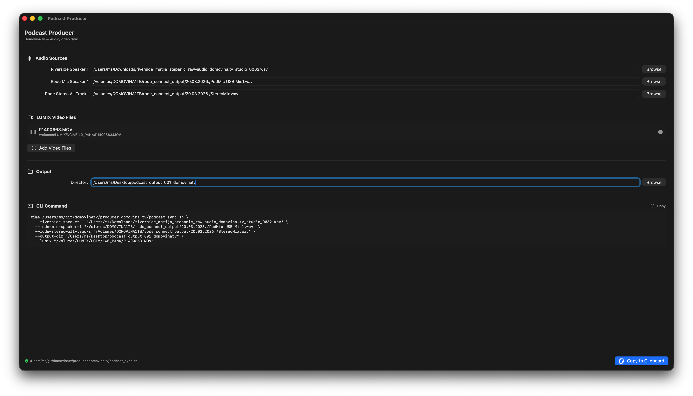

# Producer: Podcast Audio/Video Sync Tool

macOS CLI alat za savršenu sinkronizaciju lokalnog videa i zvuka (Lumix + Rode) s Riverside.fm snimkama, bez potrebe za video renderiranjem. Alat štedi sate montaže spajanjem i preciznim poravnavanjem teških datoteka koristeći zero-render tehnike.

Built and used by [Domovina.tv](https://domovina.tv).

## 🛑 The Problem
Relying 100% on cloud podcast recorders (like Riverside.fm) can be risky due to connection drops or "mic bleed" causing poor track separation. Local recordings are safer and offer better quality, but:
1. Manually syncing gigabytes of video and audio is tedious.
2. Re-encoding 100GB+ video files just to replace the audio track takes hours.

## ✅ The Solution
This script uses `audio-offset-finder` to mathematically calculate exact delay times between your cloud backup and local files. It then uses `ffmpeg` stream copying (`-c copy`) to inject the perfect local audio into your massive local video files **without re-encoding**. A process that used to take hours now takes minutes.

## ⚙️ Prerequisites
You must be on macOS and have the following tools installed:
* **ffmpeg** & **ffprobe** (`brew install ffmpeg`)
* **audio-offset-finder** (`pip install audio-offset-finder`)
* **afinfo** (Native to macOS, no installation required)

## 🚀 Installation
Clone the repository and make the script executable:
```bash
git clone https://github.com/domovinatv/producer.domovina.tv.git
cd producer.domovina.tv
chmod +x podcast_sync.sh
```

## 🛠️ Usage
The script uses named arguments. Order does not matter. You can pass as many `--lumix` video files as you need (e.g., if your camera split the recording into multiple `.MOV` or `.MP4` files).

```bash
./podcast_sync.sh \
  --output-dir "/Volumes/LUMIX/podcast_output_final" \
  --riverside-speaker-1 "/Users/ms/Downloads/riverside_speaker1_raw.wav" \
  --rode-mic-speaker-1 "/Volumes/DOMOVINA1TB/rode_connect/PodMic USB Mic1.wav" \
  --rode-stereo-all-tracks "/Volumes/DOMOVINA1TB/rode_connect/StereoMix.wav" \
  --lumix "/Volumes/LUMIX/DCIM/140_PANA/P1400661.MOV" \
  --lumix "/Volumes/LUMIX/DCIM/140_PANA/P1400662.MOV"
```

### Optional flags
| Flag | Description |
|------|-------------|
| `--dry-run` | Calculates all offsets but skips the final muxing step. Useful for verifying sync values before committing to a full run. |
| `--help`, `-h` | Prints usage instructions and exits. |

## 🧠 How It Works (Under the Hood)
1. **Validates Environment:** Checks that all required tools (`ffmpeg`, `ffprobe`, `afinfo`, `audio-offset-finder`) are installed before starting.
2. **Validates Input Files:** Verifies that all provided file paths actually exist on disk.
3. **Reads Duration:** Extracts exact duration from the Riverside.fm file.
4. **First Sync:** Compares the Riverside individual mic track with the local Rode mic track to find the exact audio start delay.
5. **Cuts the Gold Audio:** Trims the local `StereoMix.wav` to perfectly match the length and start time of the cloud session.
6. **Extracts Camera Audio:** Pulls a temporary, low-quality audio track from the first LUMIX video file.
7. **Second Sync:** Compares the trimmed "Gold Audio" with the camera audio to find where the podcast started in the video file.
8. **Disk Space Check:** Warns if the output disk has less than 10 GB of free space.
9. **Zero-Render Muxing:** Uses `ffmpeg concat demuxer` to trim the start of the first video, append any subsequent video files, and replace the audio track with the Gold Audio—all via stream copy (`-c copy`). Output is timestamped (e.g., `Podcast_20260320_143000.mov`) to prevent overwrites.

All runs are logged to `sync_YYYYMMDD_HHMMSS.log` in the output directory. Temporary files are automatically cleaned up via a `trap`, even if the script fails mid-execution.

## 🖥️ GUI App (Podcast Producer)

A native macOS SwiftUI app that provides a visual interface for selecting files and generating the CLI command. Instead of manually typing long file paths, use the GUI to browse for files and copy the ready-made command to your terminal.



### Requirements
* macOS 14 (Sonoma) or later
* Xcode or Swift toolchain installed

### Build & Run
```bash
cd PodcastProducer
swift run
```

Or open in Xcode:
```bash
open PodcastProducer/Package.swift
```

### Features
* Native file pickers for audio (`.wav`) and video (`.mov`, `.mp4`) files
* Drag & drop support for LUMIX video files
* Auto-detects `podcast_sync.sh` location
* Generates the full CLI command with `time` supervisor
* One-click **Copy to Clipboard** — paste into terminal and run

## 📝 License
This project is open-sourced under the MIT License.
